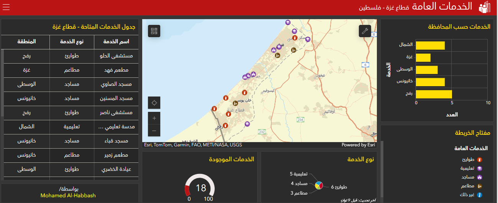

# Public-Services-Dashboard
This project was built using ArcGIS Online to demonstrate a real-time data workflow.  
The process started by designing a complete Web Map in Map Viewer, including all required layers, symbology, and pop-ups.  

After publishing the Web Map, a real-time Dashboard was created to visualize the incoming data through charts, indicators, lists, and maps.  
Field data was then collected using ArcGIS Field Maps, where each new record added in the mobile app was automatically synchronized with the Web Map and reflected instantly in the Dashboard.

Due to public-sharing restrictions in the ArcGIS 21-day trial account, the live Dashboard cannot be shared. 
A static preview image is provided in this repository instead.

**The data is not real and is for display purposes only.

